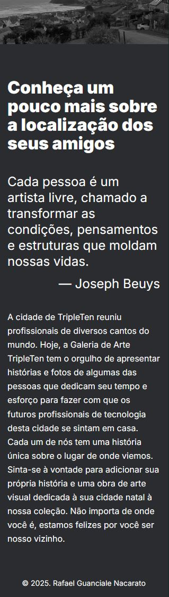

# De Pátria para Pátria — Web Development

**Visualizar projeto:** https://rafaguanciale.github.io/web_project_homeland/

O projeto De Pátria para Pátria foi desenvolvido como parte da Sprint 5 do curso de Web Development da TripleTen.
Esta sprint marca uma evolução importante porque é onde a responsividade finalmente se torna o foco principal, e o desenvolvimento começa a se aproximar de projetos reais:

- Layout completamente baseado em Figma (1280px, 768x e 320px)
- Metodologia BEM
- CSS modularizado
- Ajustes de tipografia, margens e proporções com precisão
- Conceitos de responsividade (desktop para mobile)
- Uso correto de fontes personalizadas, breakpoints e imagens fluidas

A Sprint 5 representou o momento de consolidar a capacidade de escrever layouts profissionais, respeitando os espaçamentos específicos do design original.

## Tecnologias Utilizadas

- HTML5
- CSS3
- Flexbox
- Normalize.css
- Metodologia BEM
- @media queries
- Importação de fontes em uma nova camada de CSS utilizando @font-face
- Design do Figma

## Principais Funcionalidades e Soluções Técnicas

1. Layout baseado no Figma com fidelidade de espaçamentos

- Margens horizontais calculadas conforme o design (148px para alinhamento da seção Location com a imagem principal)
- Uso rigoroso de proporções definidas no arquivo original

2. Responsividade real

- Breakpoints para tablets e mobile
- Ajustes progressivos de tipografia
- Redução de margens fixas em telas menores
- Imagens fluidas usando max-width: 100%

3. Arquitetura modular de CSS

- Cada bloco com seu próprio arquivo
- page.css para estilos globais e fonts.css para tipografia
- Organização que mantém o código limpo, escalável e fácil de manter

## Aprendizados Pessoais

Este projeto fortaleceu minha compreensão sobre como construir layouts fiéis a designs profissionais. Alguns aprendizados importantes:

- A importância das margens laterais e como pequenos desvios afetam o layout inteiro
- Diferença real entre fontes variáveis e estáticas e como isso altera quebras de linha
- Como trabalhar com breakpoints de forma estratégica, não “no chute”
- Como um bloco deve ser independente em BEM, sem depender das classes de outro
- Como manter CSS modular sem poluir o código global
- Atenção aos detalhes do Figma (tipografia, line-height, espaçamentos)

Essa sprint consolidou minha visão de estrutura não só fazer funcionar, mas fazer certo.

## Melhorias Futuras

- Adicionar animações suaves em elementos-chave
- Criar uma versão multilíngua da página
- Otimizar imagens para carregamento mais rápido

## Screenshots

Página completa - 1280px

Página completa - 768px

Página completa - 320px

